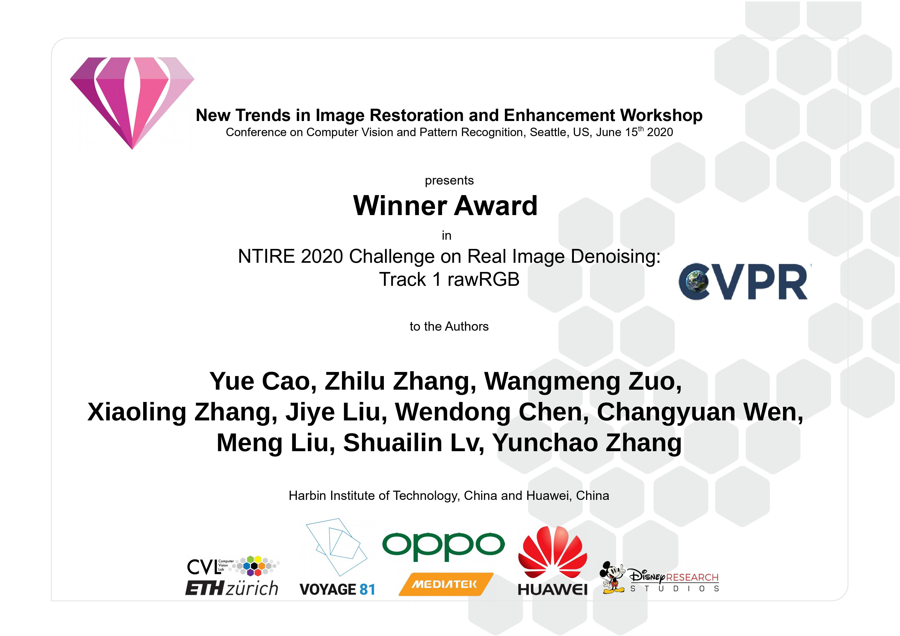
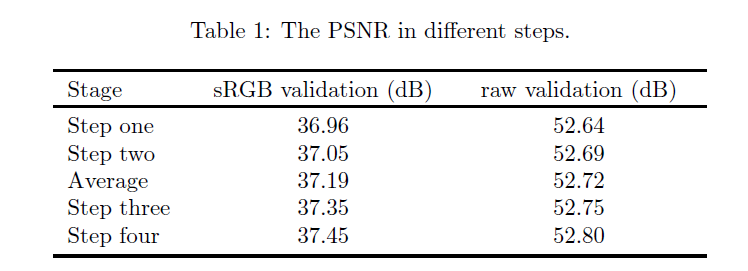

# Distillating Knowledge from Original Network and Siamese Network for Real Image Denoising

## Acknowledgement

Thank the Professor Wangmeng Zuo for his guidance and help in this work.

## MWRCANet



<b>Winner Award in NTIRE 2020 Real Image Denoising Challenge - Track 1 - rawRGB</b>

Dn_RAW_MWRCANet


<b>3rd Place Award in NTIRE 2020 Real Image Denoising Challenge - Track 2 - sRGB</b>

Dn_sRGB_MWRCANet

## General method description

Compared with other denoising networks to design the complex network structure, we mainly use distillating knowledge and NAS (Neural Architecture Search technology) to improve the denoising performance. 
Our method included four-step training procedures. First, we take advantage of both MWCNN[1] and ResNet[4] to propose mwresnet (multi-level wavelet- resnet) as Original Network. 
The Discrete Wavelet Transformation (DWT) Inverse Discrete Wavelet Transformation (IWT) are realized by convolution operation and deconvolution operation with fixed convolution kernel parameters, respectively. 
Second, we are based on Original Network to design the Siamese Network by use of NAS technology. 
By using evolutionary algorithm search for the efficient basic block with the search space(block number, type and channel number) to replace the residual block in mwresnet, we get the Siamese Network which is named mwrcanet (multi-level wavelet-residual channel attention network).
The Dense Block in densenet[3] and Residual Channel Attention Block (RCAB) in RCAN[2] are considered in the search area about block type. 
Through the training of mwresnet and mwrcanet, we get denoising results of validation set and test set.
The averaged denoising results (between original network and siamese network) and original noisy images pair became the new training data in distillating knowledge stage. 
In the third training step, we finetune those two networks. 
In the fourth training step, we finetune siamese network through the use of the noisy images and denoised results of both original network and siamese network. We only use the Siamese Network to get the final denoised results. 
Those two networks can complement each other to improve denoising performance in distillating
knowledge stage.

## Quantitative and qualitative advantages of the proposed solution

### Ablation Study (ntire 2020 / SIDDPlus)



In summary, we believe that using distillating knowledge strategy can improve the denoising network and gain better restoration performance.

### Performance in Raw space validation (dB)

| Networks | SIDDPlus |SIDD |
| - | - | - |
| mwrcanet |52.80 | 52.38 |
| mwrcanet w/o ensembles|52.79 | 52.35 |

In testing stage, we only use the Siamese Network to get the final denoised results. We use the self-ensemble to average the eight eight outputs through the same network to improve the denoising performance.

### Reference

[1] Liu P, Zhang H, Zhang K, et al. Multi-level wavelet-CNN for image restoration[C]. Proceedings of
the IEEE Conference on Computer Vision and Pattern Recognition Workshops. 2018: 773-782.

[2] Zhang Y , Li K , Li K , et al. Image Super-Resolution Using Very Deep Residual Channel Attention
Networks[C]. ECCV 2018.

[3] Huang G, Liu Z, Maaten LVD, et al. Densely Connected Convolutional Networks[C]. CVPR 2017.

[4] He K , Zhang X , Ren S , et al. Deep Residual Learning for Image Recognition[C]// CVPR 2016.

## Usage

### Dependencies

```bash
pip install torch
pip install scipy
```

### Required mat file (Raw)

validation data mat (Ntire 2020 / SIDDPlus)

./mat/siddplus_valid_gt_raw.mat

./mat/siddplus_valid_noisy_raw.mat

validation data mat (Ntire 2019 / SIDD)

./mat/ValidationGtBlocksRaw.mat

./mat/ValidationNoisyBlocksRaw.mat

### Pre-trained model (Raw)

Raw space './net_last_ckpt/dn_mwrcanet_raw_c1.pth'

### download link

Download the mat file and Pre-trained model with the following url
- [BaiduNetDisk](https://pan.baidu.com/s/1Hbo86y3NYYf-WtLONRH3Sg) password：0odp

- [GoogleDrive](https://drive.google.com/drive/folders/1T23SqUEE1_oGGBK-gaRJ3L1jfVctRQtX?usp=sharing)

### Evaluation (Raw)

Ntire 2020 (SIDDPlus) validation data

```bash
python DN_valid_SIDDPlus.py
```

Ntire 2019 (SIDD) validation data

```bash
python DN_valid_SIDD.py
```

## Authors and Affiliation

Yue Cao cscaoyue@gmail.com cscaoyue@hit.edu.cn, Harbin Institute of Technology, China

Zhilu Zhang, cszlzhang@outlook.com, Harbin Institute of Technology, China

Wangmeng Zuo, cswmzuo@gmail.com, Harbin Institute of Technology, China

Xiaoling Zhang, zhangxiaoling14@huawei.com, Huawei, China

Jiye Liu, liujiye3@huawei.com, Huawei, China

Wendong Chen, chenwendong3@huawei.com, Huawei, China

Changyuan Wen, wenchangyuan@huawei.com, Huawei, China

Meng Liu, liumeng32@huawei.com, Huawei, China

Shuailin Lv, lvshuailin@huawei.com, Huawei, China

Yunchao Zhang, zhangyunchao1@huawei.com, Huawei, China

## To-Do

* [x] To test pre-trained RAW_MWRCANet on SIDD (Ntire 2019) and SIDDPlus (Ntire 2020)

* [ ] To test pre-trained sRGB_MWRCANet on SIDD (Ntire 2019) and SIDDPlus (Ntire 2020) (soon)

* [ ] Real Image Denoising(RID) Training Code Tookit. To release the traning code of RAW_MWRCANet and sRGB_MWRCANet (CBDNet and PT-MWRN) in PyTorch version (it takes a long time)

## Contact

Please send email to cscaoyue@gmail.com or cscaoyue@hit.edu.com
